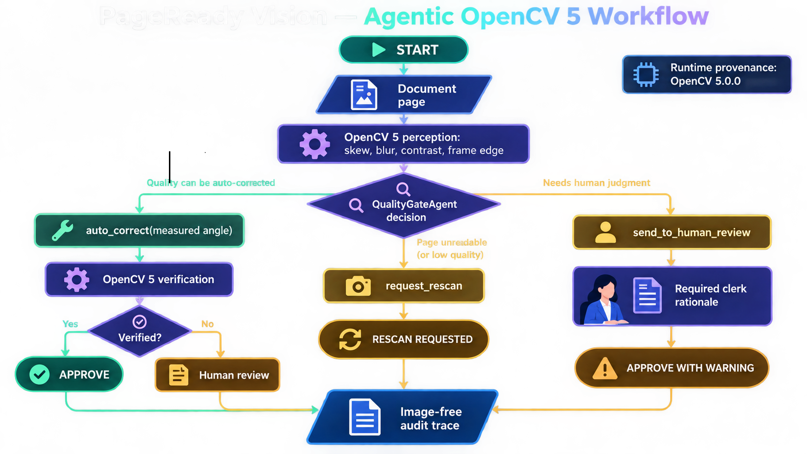
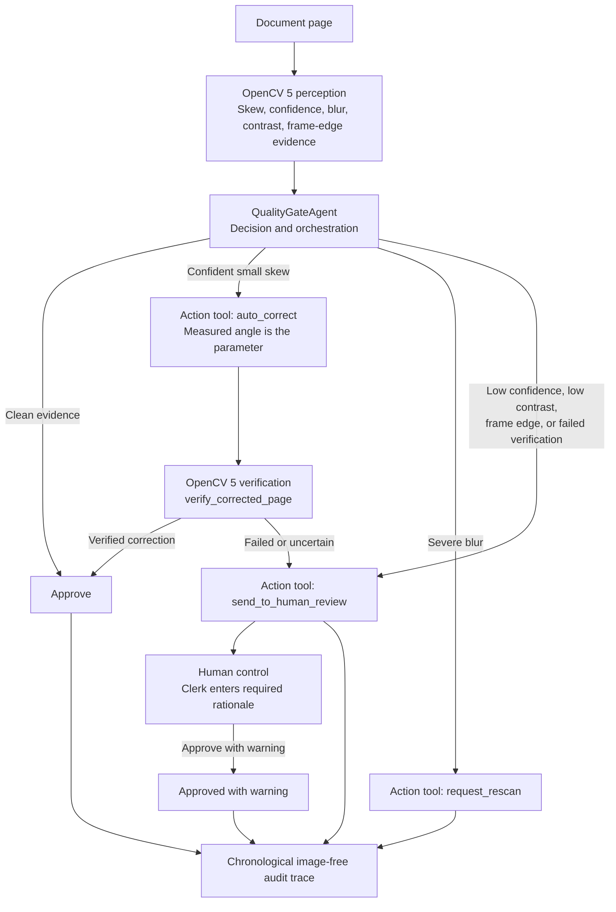

# Agentic Vision Award Evidence

## Required Agentic Vision workflow diagram



The pictorial diagram is the recommended on-screen asset for the submission
video; the Mermaid version below remains the source-controlled, accessible
diagram.



The Agentic Vision workflow separates visual perception, autonomous decision-making, action execution, verification, and human oversight. OpenCV 5 first measures document-quality evidence including skew angle, blur, contrast, confidence, and frame-edge conditions. The QualityGateAgent then reasons over those measurements to select an appropriate action.

The strongest agentic branch is automatic skew correction. When the system detects a confident, limited skew, the measured OpenCV 5 angle is passed directly to the `auto_correct` action as its correction parameter. The corrected page is then independently evaluated by `verify_corrected_page`. If the new OpenCV 5 evidence confirms that the correction succeeded, the page is approved. If verification fails or remains uncertain, the agent escalates the page to human review.

This creates a closed perception-action-verification loop in which computer-vision evidence affects both what action is taken and whether that action is ultimately accepted. Severe blur instead triggers a rescan request, while low confidence, poor contrast, frame-edge evidence, or failed verification routes the document to a clerk. Human approval requires an explicit rationale, and every system and human decision is recorded in a chronological image-free audit trace.

This diagram shows the required perception, decision/orchestration, and action
stages. The correction branch is the central Agentic Vision proof: an OpenCV 5
measurement changes the `auto_correct` parameter, and later OpenCV 5 evidence
changes whether the system approves or escalates.
The architecture can be summarized as:
1. Perception: OpenCV 5 measures skew, confidence, blur, contrast, and frame-edge evidence.
2. Agent decision: QualityGateAgent interprets those measurements and selects an action.
3. Action: approve, auto-correct, request rescan, or send to human review.
4. Verification: corrected pages are re-evaluated by OpenCV 5.
5. Human control: uncertain cases require clerk rationale rather than silent approval.
6. Auditability: every outcome reaches a chronological, image-free audit trace.
## Trace demonstration

The `council-minutes-skewed.png` fixture proves that a vision measurement
changes later behavior:

1. OpenCV measures a skew angle and confidence.
2. Policy selects `auto_correct` only in its validated range.
3. The deskew tool receives the measured angle as its parameter.
4. OpenCV re-analyzes the tool output.
5. The post-correction skew result determines whether the page is approved or
   sent to human review.

Every trace now includes a `runtime_provenance` event with the exact OpenCV
version used to produce that run. This makes it possible to distinguish an
OpenCV 5 demonstration from local development evidence.

Run and retain the artifact:

```powershell
.\.venv\Scripts\python.exe scripts\evaluate.py --output runs\evaluation.json
```

The report records fixture-level expected/observed actions, tool sequences,
failure counts, unsafe-approval count, and runtime provenance. It is a smoke
evaluation only; do not present it as the 150-page holdout evaluation in
`docs/evaluation.md`.

## Human control and failure handling

- Blur triggers a rescan request rather than an invented correction.
- Low contrast, weak evidence, frame-edge content, or failed correction go to
  human review.
- A clerk can approve a review item only with a non-empty override note.
- The decision trace retains both machine evidence and the clerk action.

## Award evidence map

| Required evidence | Project proof | What to show in the video or screenshots |
| --- | --- | --- |
| Agent workflow diagram | Mermaid diagram above; deployed-system diagram in `architecture.md` | Display this diagram and name the flow: OpenCV perception → QualityGateAgent decision → action tool → OpenCV verification. |
| OpenCV output changes later action | `council-minutes-skewed.png` trace and `runs/evaluation.json` | Show measured skew, `auto_correct`, verification, and approval in one continuous capture. |
| Task success | Four-fixture smoke evaluation: 4/4 expected outcomes | Show the completed queue summary and evaluation artifact. |
| Failure handling | Blur requests rescan; uncertainty routes to review | Show the blurred and low-contrast outcomes. |
| Observability | Runtime provenance, evidence, tool, verification, and resolution trace events | Open a page trace and show `runtime_provenance` reporting OpenCV 5.x. |
| Human control | Required non-empty clerk note before warning approval | Enter a real review rationale and show the warning remains in the trace. |

## Submission checklist

- Show this diagram or the equivalent architecture diagram.
- Show the skewed fixture's initial evidence, `auto_correct` tool event,
  verification event, and changed final action in one continuous capture.
- Show `runtime_provenance` reporting OpenCV 5.x. Do not claim OpenCV 5 until
  that captured value is actually 5.x.
- Include `runs/evaluation.json`, labeled with its recorded environment and
  limited scope.
